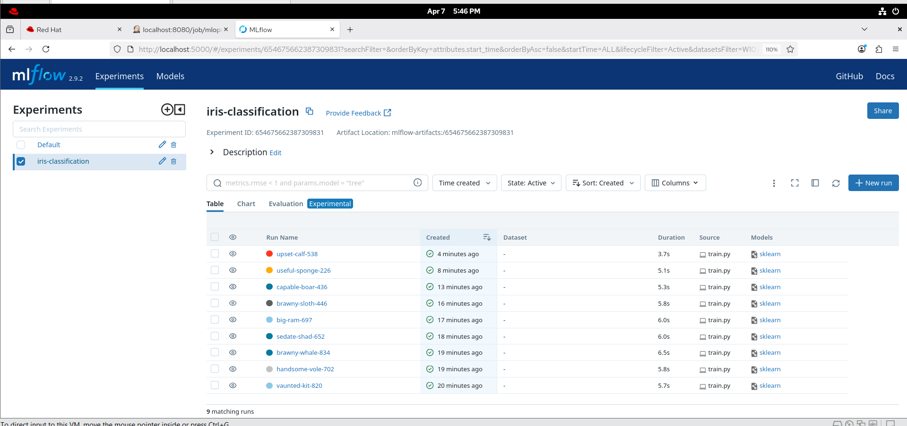
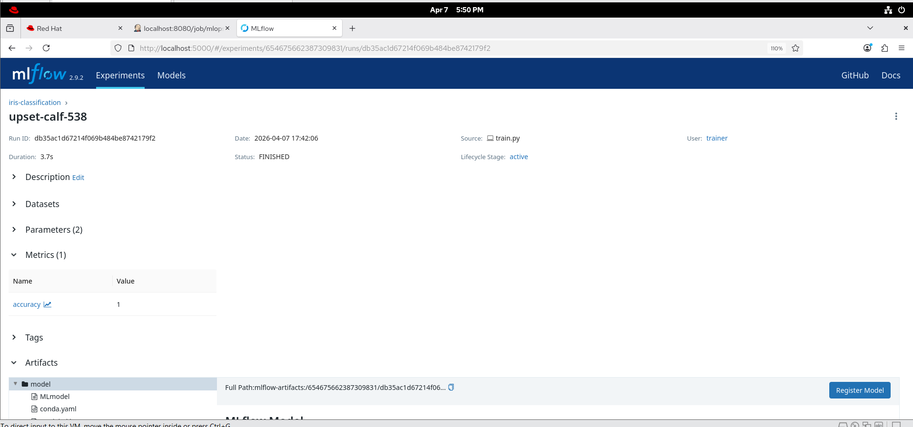
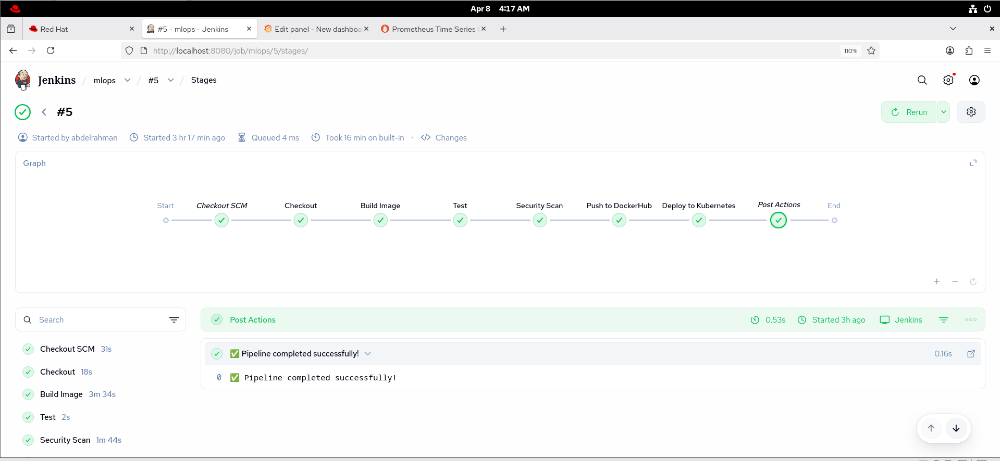
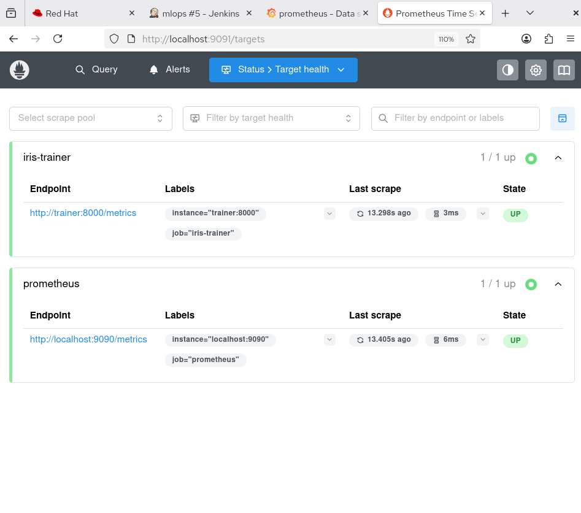
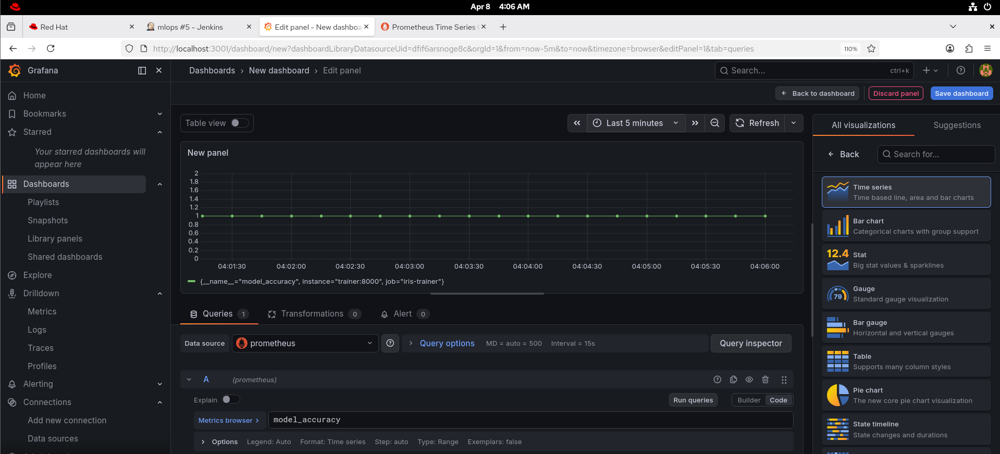

# 🤖 Iris MLOps Pipeline


A production-grade MLOps pipeline for training and monitoring an Iris Classification model using Docker, Kubernetes, Jenkins, MLflow, Prometheus, and Grafana.

---

## 🏗️ Architecture
Developer → GitHub → Jenkins CI/CD Pipeline
↓
Build Docker Image
↓
Run Tests
↓
Security Scan (Trivy)
↓
Push to DockerHub
↓
Deploy to Kubernetes Cluster
↙         ↘
MLflow          Prometheus
(Experiment      (Metrics Collection)
Tracking)              ↓
Grafana
(Dashboard)

---

## 🛠️ Tech Stack

| Tool | Purpose |
|------|---------|
| **Docker** | Containerization with Multi-stage builds |
| **Kubernetes** | Container orchestration |
| **Jenkins** | CI/CD Pipeline automation |
| **MLflow** | Experiment tracking & model registry |
| **Prometheus** | Metrics collection |
| **Grafana** | Monitoring dashboard |
| **Trivy** | Security vulnerability scanning |
| **scikit-learn** | Iris classification model |

---

## 📁 Project Structure
iris-mlops/
├── train.py                    # Training script with MLflow integration
├── requirements.txt            # Python dependencies
├── Dockerfile                  # Multi-stage Docker build
├── docker-compose.yml          # Local development setup
├── prometheus.yml              # Prometheus configuration
├── Jenkinsfile                 # CI/CD pipeline definition
└── k8s/
├── mlflow-deployment.yaml      # MLflow server
├── trainer-deployment.yaml     # AI trainer
├── prometheus-deployment.yaml  # Prometheus
└── grafana-deployment.yaml     # Grafana

---

## 🚀 CI/CD Pipeline Stages

Checkout      → Pull code from GitHub  
Build         → Build Docker image with git SHA tag  
Test          → Run tests inside container  
Security Scan → Scan with Trivy for vulnerabilities  
Push          → Push image to DockerHub  
Deploy        → Deploy all services to Kubernetes  

---

## 🤖 MLflow Experiment Tracking

The training script automatically logs to MLflow:

- **Parameters:** `n_estimators`, `max_depth`
- **Metrics:** `accuracy`
- **Model:** scikit-learn RandomForest model

Access MLflow UI:  
http://localhost:5000

---

## 📊 Monitoring

### Prometheus
Collects metrics from the iris-trainer service.  
http://localhost:9091

### Grafana

Visualizes `model_accuracy` and other metrics in real-time.  
http://localhost:3000  
Username: admin  
Password: admin

---

## 🔧 Local Development

```bash
# Clone the repo
git clone https://github.com/abdelrahmannayf/iris-mlops.git
cd iris-mlops

# Run locally with docker-compose
docker-compose up

# Access services
# MLflow:     http://localhost:5000
# Grafana:    http://localhost:3000
# Prometheus: http://localhost:9090
## 🔒 Security

- Docker images scanned with **Trivy** on every build
- Containers run as **non-root** user
- Secrets managed via **Jenkins Credentials**
- Multi-stage builds to minimize attack surface

---

## 👨‍💻 Author

**Abdelrahman Nayf**  
- GitHub: [@abdelrahmannayf](https://github.com/abdelrahmannayf)
